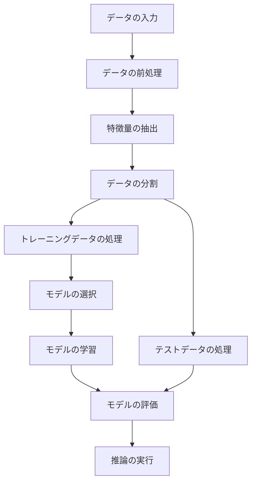

### フローの各処理内容

前述のフロー処理内容をそのまま使用できます。

#### データの入力

```python
def data_input(file_path):
    import pandas as pd
    data = pd.read_csv(file_path)
    return data
```

#### データの前処理

```python
def data_preprocessing(data):
    # 欠損値の処理
    data['num_rooms'].fillna(data['num_rooms'].median(), inplace=True)
    data['area'].fillna(data['area'].median(), inplace=True)
    data['age'].fillna(data['age'].median(), inplace=True)
    data['location'].fillna('unknown', inplace=True)
    data['price'].fillna(data['price'].median(), inplace=True)
    
    # カテゴリカルデータのエンコード
    data = pd.get_dummies(data, columns=['location'], drop_first=True)
    
    return data
```

#### 特徴量の抽出

```python
def feature_extraction(data):
    features = data.drop(columns=['price'])
    target = data['price']
    return features, target
```

#### データの分割

```python
def split_data(features, target):
    from sklearn.model_selection import train_test_split
    X_train, X_test, y_train, y_test = train_test_split(features, target, test_size=0.2, random_state=42)
    return [[X_train, y_train], [X_test, y_test]]
```

#### トレーニングデータの処理

```python
def process_training_data(X_train):
    from sklearn.preprocessing import StandardScaler
    scaler = StandardScaler()
    X_train_scaled = scaler.fit_transform(X_train)
    return X_train_scaled, scaler
```

#### テストデータの処理

```python
def process_test_data(X_test, scaler):
    X_test_scaled = scaler.transform(X_test)
    return X_test_scaled
```

#### モデルの選択

```python
def select_model(model_type='Linear_regression'):
    from sklearn.linear_model import LinearRegression
    from sklearn.tree import DecisionTreeRegressor
    
    if model_type == 'Linear_regression':
        model = LinearRegression()
    elif model_type == 'decision_tree':
        model = DecisionTreeRegressor()
    else:
        raise ValueError('Unknown model type')
    
    return model
```

#### モデルの学習

```python
def train_model(model, X_train, y_train):
    model.fit(X_train, y_train)
    return model
```

#### モデルの評価

```python
def evaluate_model(model, X_test, y_test):
    from sklearn.metrics import mean_squared_error
    
    predictions = model.predict(X_test)
    mse = mean_squared_error(y_test, predictions)
    return mse
```

#### 推論の実行

```python
def run_inference(model, new_data):
    predictions = model.predict(new_data)
    return predictions
```

### 全体の実行例

```python
# 1. データの入力
data = data_input('large_dirty_housing_data.csv')

# 2. データの前処理
processed_data = data_preprocessing(data)

# 3. 特徴量の抽出
features, target = feature_extraction(processed_data)

# 4. データの分割
X_train, X_test, y_train, y_test = split_data(features, target)

# 5. トレーニングデータの処理
X_train_scaled, scaler = process_training_data(X_train)

# 6. テストデータの処理
X_test_scaled = process_test_data(X_test, scaler)

# 7. モデルの選択
model = select_model('Linear_regression')

# 8. モデルの学習
trained_model = train_model(model, X_train_scaled, y_train)

# 9. モデルの評価
mse = evaluate_model(trained_model, X_test_scaled, y_test)
print(f'Mean Squared Error: {mse}')

# 10. 推論の実行
new_data = X_test_scaled[:5]  # 新しいデータの例としてテストデータの一部を使用
predictions = run_inference(trained_model, new_data)
print(f'Predictions: {predictions}')
```

この大規模サンプルデータを使うことで、データ前処理や特徴量抽出のテストがより現実的なシナリオで行えるようになります。


### 全体フロー
