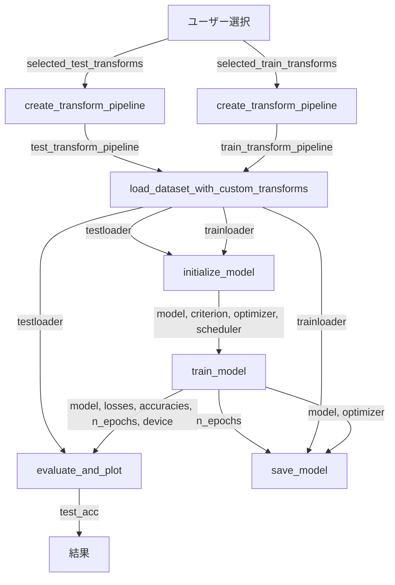

```python
# ライブラリのインポート
import matplotlib.pyplot as plt
import numpy as np

import torch
import torch.nn as nn
import torch.optim as optim
import torchvision
import torchvision.models as models
import torchvision.transforms as transforms

import time
import datetime
import os
import PIL.Image as Image
from tqdm import tqdm
from sklearn.metrics import confusion_matrix, classification_report, roc_curve, auc
import seaborn as sns
```

### 前処理のパイプライン

```python
def create_transform_pipeline(selected_options, normalize_params=None, color_jitter_params=None):
    resize = (80, 80) # パラメータ
    normalize_params = ((0.5, 0.5, 0.5), (0.5, 0.5, 0.5))  # 正規化のためのパラメータ
    color_jitter_params = {"brightness": 0.2, "contrast": 0.2, "saturation": 0.2, "hue": 0.1}  # カラージッターのパラメータ

    transform_list = []
    
    for option in selected_options:
        if option == "resize" and resize is not None:
            transform_list.append(transforms.Resize(resize))
        elif option == "random_horizontal_flip":
            transform_list.append(transforms.RandomHorizontalFlip(p=0.5))
        elif option == "color_jitter" and color_jitter_params is not None:
            transform_list.append(transforms.ColorJitter(**color_jitter_params))
        elif option == "to_tensor":
            transform_list.append(transforms.ToTensor())
        elif option == "normalize" and normalize_params is not None:
            transform_list.append(transforms.Normalize(*normalize_params))
    
    transform_pipeline = transforms.Compose(transform_list)
    return transform_pipeline
```

### 定義した前処理を使用して学習データとテストデータを読み込む
```python
def load_dataset_with_custom_transforms(train_transform, test_transform):
    batch_size = 64 # パラメータ
    dataset_dir = "./data/" # パラメータ

    train_dataset = torchvision.datasets.ImageFolder(root=dataset_dir + "train", transform=train_transform)
    trainloader = torch.utils.data.DataLoader(train_dataset, batch_size=batch_size, shuffle=True, num_workers=2)

    test_dataset = torchvision.datasets.ImageFolder(root=dataset_dir + "test", transform=test_transform)
    testloader = torch.utils.data.DataLoader(test_dataset, batch_size=batch_size, shuffle=False, num_workers=2)

    return trainloader, testloader
```

### モデルの初期化
```python
def initialize_model():
    num_labels = 2 # パラメータ
    learning_rate = 0.01 # パラメータ

    model = models.resnet18(pretrained=True)
    num_ftrs = model.fc.in_features
    model.fc = nn.Linear(num_ftrs, num_labels)

    criterion = nn.CrossEntropyLoss() # パラメータ
    optimizer = optim.SGD(model.parameters(), lr=learning_rate, momentum=0.9) # パラメータ
    scheduler = optim.lr_scheduler.ReduceLROnPlateau(optimizer, mode='max', patience=3, threshold=0.9) # パラメータ

    return model, criterion, optimizer, scheduler
```

### モデルの学習
```python
def train_model(model, trainloader, criterion, optimizer, scheduler):
    batch_size = 64 # パラメータ
    n_epochs = 3 # パラメータ
    device = torch.device("cuda:0" if torch.cuda.is_available() else "cpu") # パラメータ

    losses = []
    accuracies = []
    test_accuracies = []
    best_acc = 0.0

    model.to(device)
    model.train()
    for epoch in range(n_epochs):
        since = time.time()
        running_loss = 0.0
        running_correct = 0.0

        for i, data in enumerate(tqdm(trainloader), 0):
            inputs, labels = data
            inputs = inputs.to(device)
            labels = labels.to(device)
            optimizer.zero_grad()

            outputs = model(inputs)
            _, predicted = torch.max(outputs.data, 1)
            loss = criterion(outputs, labels)
            loss.backward()
            optimizer.step()

            running_loss += loss.item()
            running_correct += (labels == predicted).sum().item()

        epoch_duration = time.time() - since
        epoch_loss = running_loss / len(trainloader)
        epoch_acc = 100 / batch_size * running_correct / len(trainloader)
        print("Epoch %s, duration: %d s, loss: %.4f, acc: %.4f" % (epoch+1, epoch_duration, epoch_loss, epoch_acc))

        losses.append(epoch_loss)
        accuracies.append(epoch_acc)

        scheduler.step(epoch_acc)

    print('Finished Training')
    return model, losses, accuracies, n_epochs, device
```

### モデルの評価とプロット
```python
def evaluate_and_plot(model, testloader, device):
    num_labels = 2 # パラメータ
    
    def plot_confusion_matrix(y_true, y_pred, classes):
        # 混同行列を計算
        cm = confusion_matrix(y_true, y_pred)

        # 図を作成し、混同行列をヒートマップとして表示
        fig, ax = plt.subplots(figsize=(8, 8))
        sns.heatmap(cm, annot=True, fmt='d', cmap='Blues', xticklabels=classes, yticklabels=classes)

        # 軸ラベルを設定
        ax.set_ylabel('Actual')  # 実際のクラス
        ax.set_xlabel('Predicted')  # 予測されたクラス

        # 混同行列の画像を保存
        plt.savefig('result/confusion_matrix.png')

        # 図を表示
        plt.show()

    def classification_metrics(y_true, y_pred, classes):
        # 分類の結果をレポートとして表示
        print(classification_report(y_true, y_pred, target_names=classes))

    def plot_roc_curve(y_true, y_scores):
        # ROC曲線のデータを計算
        fpr, tpr, _ = roc_curve(y_true, y_scores)
        roc_auc = auc(fpr, tpr)

        # ROC曲線をプロット
        plt.figure(figsize=(8, 8))
        plt.plot(fpr, tpr, color='darkorange', lw=2, label='ROC curve (area = %0.2f)' % roc_auc)

        # ランダムな分類器のラインを追加
        plt.plot([0, 1], [0, 1], color='navy', lw=2, linestyle='--')

        # 軸のラベルとタイトルを設定
        plt.xlabel('False Positive Rate')
        plt.ylabel('True Positive Rate')
        plt.title('Receiver Operating Characteristic Curve')

        # 凡例を追加
        plt.legend(loc="lower right")

        # ROC曲線の画像を保存
        plt.savefig('result/roc_curve.png')

        # 図を表示
        plt.show()

    y_true = []
    y_pred = []
    y_scores = []

    model.eval()
    with torch.no_grad():
        for i, data in enumerate(tqdm(testloader), 0):
            images, labels = data
            images = images.to(device)
            labels = labels.to(device)

            outputs = model(images)
            _, predicted = torch.max(outputs.data, 1)

            y_true.extend(labels.cpu().numpy())
            y_pred.extend(predicted.cpu().numpy())

            if num_labels == 2:
                y_scores.extend(outputs[:, 1].cpu().numpy())

    test_acc = 100.0 * sum(np.array(y_true) == np.array(y_pred)) / len(y_true)
    print('Accuracy of the network on the test images: %.2f %%' % (test_acc))

    class_names = list(testloader.dataset.class_to_idx.keys())
    plot_confusion_matrix(y_true, y_pred, class_names)
    classification_metrics(y_true, y_pred, class_names)

    if num_labels == 2:
        plot_roc_curve(y_true, y_scores)

    return test_acc
```

### 重みの保存
```python
def save_model(model, optimizer, dataset, n_epochs):
    save_path = './checkpoint/best.pth' # パラメータ

    checkpoint = {
        'state_dict': model.to('cpu').state_dict(),
        'model': model.fc,
        'class_to_idx': dataset.dataset.class_to_idx,
        'opt_state': optimizer.state_dict(),
        'num_epochs': n_epochs
    }
    torch.save(checkpoint, save_path)
```

### 全体フロー
```python
# ユーザーが選択した前処理（例として選択肢を手動で定義）
selected_train_transforms = ["resize", "random_horizontal_flip", "color_jitter", "to_tensor", "normalize"]
selected_test_transforms = ["resize", "to_tensor", "normalize"]

# 前処理パイプラインの作成

train_transform_pipeline = create_transform_pipeline(selected_train_transforms)
test_transform_pipeline = create_transform_pipeline(selected_test_transforms)

# データセットの読み込み
trainloader, testloader = load_dataset_with_custom_transforms(train_transform_pipeline, test_transform_pipeline)

# モデル初期化
model, criterion, optimizer, scheduler = initialize_model()

# モデル訓練
model, losses, accuracies, n_epochs, device = train_model(model, trainloader, criterion, optimizer, scheduler)

# モデル評価と可視化
test_acc = evaluate_and_plot(model, testloader, device)

# モデル保存
save_model(model, optimizer, trainloader, n_epochs)
```

